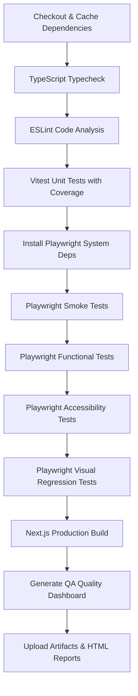

# 🧪 OwlReadme Automated Testing & Quality Assurance Documentation

This document describes how to execute, write, debug, and maintain automated tests for OwlReadme. It serves as a guide for engineering teams to maintain high code quality and prevent regressions in both functional behavior and visual appearance.

---

## 🚀 Running Tests Locally

OwlReadme uses **Vitest** for unit/integration tests and **Playwright** for End-to-End (E2E) audits (functional, smoke, accessibility, and visual).

Always run commands via `pnpm`:

### 1. Unit & Integration Tests (Vitest)
```bash
# Run all unit/integration tests
pnpm test

# Run tests in interactive watch mode
pnpm test:watch

# Generate code coverage report
pnpm test:coverage
```
*Note: The Vitest runner is configured to automatically exclude the `playwright/` folder to prevent test environment collisions.*

### 2. End-to-End Tests (Playwright)
Ensure the application is built and running locally (or let Playwright auto-launch the local dev server on port `3000` via its configured `webServer` block).

```bash
# Run all E2E test suites (Smoke, Functional, Accessibility, Visual)
pnpm test:e2e

# Run only Smoke tests (basic route loading checks)
pnpm test:smoke

# Run only Functional E2E tests (SaaS user journeys)
pnpm test:functional

# Run only Accessibility audits (axe-core WCAG checks)
pnpm test:a11y

# Run only Visual Regression audits (snapshot matches)
pnpm test:visual
```

### 3. Run Everything Locally
To run all linting, type checks, unit tests, and E2E tests in sequence matching the CI checks:
```bash
pnpm test:all
```

---

## 📸 Updating Visual Snapshots

When making intentional UI changes that alter layout design, you must regenerate the visual baseline screenshots. Run:

```bash
pnpm test:visual --update-snapshots
```
*Note: A 5% pixel discrepancy buffer (`maxDiffPixelRatio: 0.05`) is configured inside `playwright.config.ts` to allow for minor font anti-aliasing variations or dynamic timestamp outputs across browser engines without triggering false failures.*

---

## 🛠️ Debugging Playwright E2E Tests

If a Playwright test fails locally, use the following tools to diagnose the issue:

### 1. Playwright UI Mode
UI Mode provides an interactive playground to step through test code, view DOM snapshots, console logs, and network logs at each frame step.
```bash
pnpm test:e2e:ui
```

### 2. Playwright Inspector
Launch the test runner with the built-in step debugger:
```bash
PWDEBUG=1 pnpm test:e2e
```

### 3. Trace Viewer
On failures, Playwright automatically outputs a `trace.zip` zip archive containing full action records. You can load and view this archive using:
```bash
pnpm exec playwright show-trace test-results/<test-name>/trace.zip
```

---

## 🛡️ CI/CD Pipeline & Quality Release Gates

Our **GitHub Actions CI Workflow** (`.github/workflows/ci.yml`) enforces the following pipeline gate on all `push` and `pull_request` events to the `main` or `master` branches:



### 🚪 Release Merging Gates
A pull request will be **blocked** from merging if any step in the pipeline fails (e.g. failing test, build error, type mismatch, or lint violation).

---

## ✏️ Writing New E2E Tests & Best Practices

1. **Use the Page Object Model (POM)**:
   - Encapsulate page elements, selectors, and interactive helpers inside class definitions under the `playwright/pages/` folder.
   - Do not write raw CSS or XPath selectors directly in test spec files.
2. **Handle Small Screen drawer UI**:
   - On tablet/mobile viewports, certain navigation buttons are placed inside collapsible side drawers. Always use `.first()` or `:visible` filters to target the intended desktop/mobile toggle button.
3. **Seed Database/Store States**:
   - Use mock helpers in `playwright/helpers/` (such as `seedA11yWorkspace`) to set the initial `localStorage` workspace state directly, saving setup execution times.
4. **Ensure Accessibility Outlines**:
   - Always run accessibility validations via the custom axe runner wrapper to maintain standard WCAG compliance.
